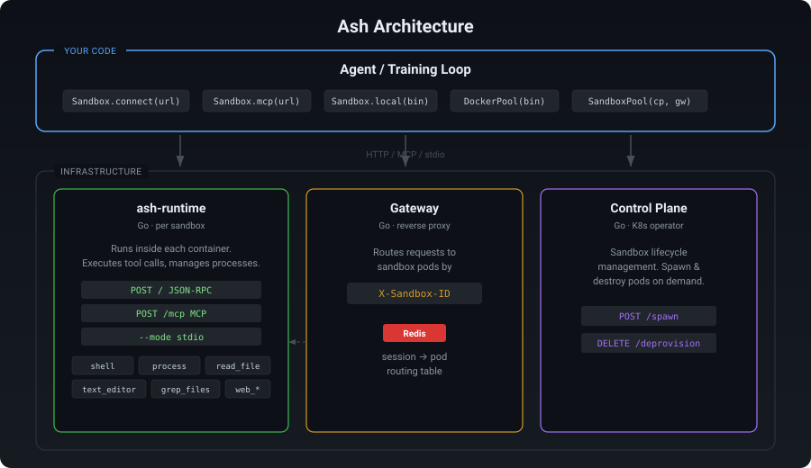

<p align="center">
  
</p>

<h1 align="center">Ash — Agent Sandbox Hive</h1>

<p align="center">
  Scalable sandbox infrastructure for LLM agents and RL training.<br/>
  Isolated execution environments with a minimal tool protocol over HTTP, MCP, or stdio.
</p>

<p align="center">
  <a href="#swe-bench-results">Results</a> •
  <a href="#quick-start">Quick Start</a> •
  <a href="#architecture">Architecture</a> •
  <a href="#runtime">Runtime</a> •
  <a href="#python-client">Client</a> •
  <a href="#k8s-infrastructure">K8s Deploy</a>
</p>

---

<p align="center">
  
</p>

## SWE-bench Verified

<table>
<tr>
<th>Model</th>
<th>Tool Mode</th>
<th align="right">Resolved</th>
<th align="right">Rate</th>
</tr>
<tr>
<td><b>Claude Opus 4.6</b></td>
<td>5-tool</td>
<td align="right">397 / 500</td>
<td align="right"><b>79.4%</b></td>
</tr>
<tr>
<td><b>Claude Sonnet 4.6</b></td>
<td>5-tool</td>
<td align="right">377 / 500</td>
<td align="right"><b>75.4%</b></td>
</tr>
<tr>
<td><b>Claude Sonnet 4.6</b></td>
<td>bash-only</td>
<td align="right">362 / 500</td>
<td align="right">72.4%</td>
</tr>
<tr>
<td><b>Claude Sonnet 4.6</b></td>
<td>Claude Code</td>
<td align="right">371 / 500</td>
<td align="right">74.2%</td>
</tr>
<tr>
<td><b>MiniMax M2.5</b></td>
<td>bash-only</td>
<td align="right">378 / 500</td>
<td align="right"><b>75.6%</b></td>
</tr>
<tr>
<td>MiniMax M2.5</td>
<td>5-tool</td>
<td align="right">353 / 500</td>
<td align="right">70.6%</td>
</tr>
<tr>
<td><b>Kimi K2.5</b></td>
<td>bash-only</td>
<td align="right">350 / 500</td>
<td align="right"><b>70.0%</b></td>
</tr>
<tr>
<td>Kimi K2.5</td>
<td>5-tool</td>
<td align="right">343 / 500</td>
<td align="right">68.6%</td>
</tr>
</table>

All runs use the same Ash sandbox environment. Most rows use Ash's shared litellm agent
loop (`5-tool` / `bash-only`); the **Claude Code** row instead drives Claude Code itself as
the agent via the `claude-code` harness. Configs: [`swebench/configs/`](swebench/configs/).

## Quick Start

```bash
# Build the runtime
cd runtime && go build -o ash-runtime .
```

### Run a single sandbox

```python
from ash_sandbox import Sandbox

async with Sandbox.connect("http://localhost:3000") as sb:
    result = await sb.call("shell", command="echo hello")
    print(result.output)
```

### Run many sandboxes with Docker

```python
from ash_sandbox import DockerPool

async with DockerPool(runtime_bin="./ash-runtime") as pool:
    sb = await pool.spawn(image="python:3.11")
    await sb.call("shell", command="pytest")
    await sb.call("text_editor", command="str_replace", path="app.py",
                  old_str="foo", new_str="bar")
```

### Run SWE-bench evaluation

```bash
pip install litellm pyyaml datasets

# Single instance
python -m swebench -c swebench/configs/bedrock-kimi25-bash.yaml -i django__django-11848

# Full run (32 workers)
python -m swebench -c swebench/configs/bedrock-kimi25-bash.yaml
```

### Deploy at scale on Kubernetes

```bash
cd k8s-config && bash deploy.sh
```

```python
from ash_sandbox import SandboxPool

async with SandboxPool(
    control_plane_url="http://control-plane:80",
    gateway_url="http://gateway:80",
) as pool:
    sandboxes = [await pool.spawn(image="my-task:latest") for _ in range(100)]
```

## Architecture

## Runtime

The `ash-runtime` binary runs inside each sandbox container. Single Go binary (~9MB), no dependencies beyond `ripgrep`.

### Run Modes

| Mode | Command | Use Case |
|------|---------|----------|
| HTTP | `ash-runtime --port 3000` | Container runtime (default) |
| stdio | `ash-runtime --mode stdio` | CLI, MCP stdio transport |
| MCP | `POST /mcp` endpoint | FastMCP, Claude Desktop, Cursor |

### Tools

| Tool | Description |
|------|-------------|
| `shell` | Execute commands. `background: true` returns a pid. |
| `process` | Read output or kill background processes. |
| `read_file` | Read files with line numbers, offset, limit. |
| `text_editor` | View, create, str_replace, insert files. |
| `grep_files` | Ripgrep search with pattern, glob, limit. |
| `web_fetch` | Fetch URLs. Formats: html, text, markdown. |
| `web_search` | Multi-engine search (Google, DuckDuckGo, Brave). |

## Python Client

```bash
pip install ash-sandbox
```

```python
from ash_sandbox import Sandbox

async with Sandbox.connect("http://localhost:3000") as sb:
    await sb.call("shell", command="pytest")
    await sb.call("text_editor", command="str_replace", path="app.py",
                  old_str="foo", new_str="bar")

    # Get schemas for LLM function calling
    tools = await sb.tool_schemas(format="openai")    # or "anthropic"

    # Execute model tool_calls directly
    result = await sb.execute_tool_call(model_tool_call)
```

### Backends

| Backend | Constructor | Routing |
|---------|-------------|---------|
| HTTP | `Sandbox.connect(url)` | Direct to one runtime |
| MCP | `Sandbox.mcp(url)` | MCP protocol handshake |
| CLI | `Sandbox.local(bin)` | Subprocess stdio |
| Gateway | `SandboxPool(cp, gw)` | X-Sandbox-ID header |

## K8s Infrastructure

| Component | Language | Role |
|-----------|----------|------|
| Control Plane | Go | REST API for sandbox lifecycle (spawn/destroy) |
| Gateway | Go | Reverse proxy, routes by sandbox ID via Redis |
| Redis | - | Session → pod routing table |
| ash-runtime | Go | Runs inside each sandbox pod |

### Control Plane API

```bash
# Create a sandbox
curl -X POST http://control-plane/create -d '{
  "image": "my-image:latest",
  "ports": [{"container_port": 3000}],
  "resources": {"requests": {"cpu": "500m", "memory": "512Mi"}}
}'
# → {"uuid": "sandbox-abc123-...", "status": "ready", ...}

# Destroy specific sandboxes
curl -X DELETE http://control-plane/destroy -d '{"ids": ["sandbox-abc123-..."]}'

# Destroy all
curl -X DELETE http://control-plane/destroy -d '{"all": true}'
```

## Project Structure

```
.
├── runtime/              # Go sandbox runtime (ash-runtime binary)
│   ├── main.go           # HTTP server + stdio + MCP endpoint
│   ├── tools/            # 7 tool implementations
│   └── events/           # Notification system
├── ash_sandbox/          # Python async client
├── swebench/             # SWE-bench evaluation harness
│   ├── agent.py          # Agent loop (litellm + tool execution)
│   ├── configs/          # Model configs (YAML)
│   └── AGENT.md          # System prompt for strong models
├── k8s-scaffold/         # K8s infrastructure (Go)
│   ├── control-plane/    # Sandbox lifecycle API
│   └── gateway/          # Session-routed reverse proxy
└── k8s-config/           # K8s manifests (deploy, rbac, infra)
```

## License

MIT
